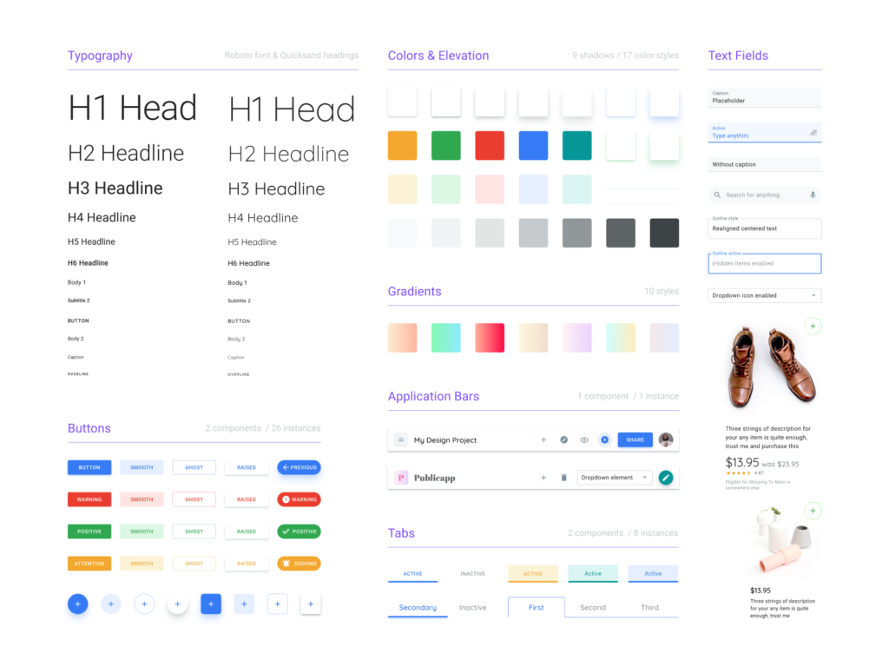
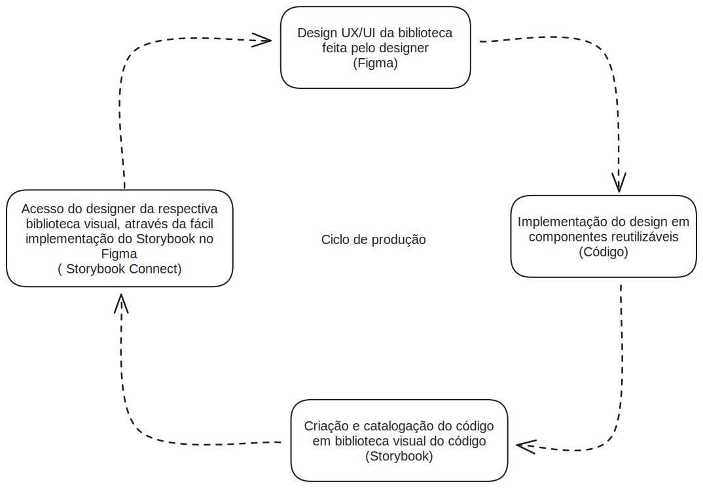

# Design System Maya

Para a criação de um aplicativo web de alto nível, é necessária a padronização de seus componentes, a fim de que ele atenda aos aspectos técnicos requisitados.

Este documento visa contextualizar as preocupações técnicas que o desenvolvedor e o designer UX/UI deve levar em consideração durante a implementação dos componentes da interface do usuário.

Problemas a serem resolvidos

## Problemas a serem resolvidos

!!!!!!!**TO-DO!!!!!!**

## Ciclo para projetos de pequeno porte

Para projetos de pequeno porte, que geralmente envolvem apenas uma landing page institucional, não é necessário que haja na implementação do design a componetização dos elementos UI em suas menores partes, sendo suficiente apenas o mockup da landing page versão mobile e desktop, em escala.

Durante o processo de implementação em código, porém, é boa prática do desenvolvedor abstrair os componentes em suas menores partes(button, text input, etc…), garantindo assim melhor abstração e reaproveitamento dos componentes, que juntos constituem componentes mais complexos, como um dashboard ou uma navigation bar.

## Ciclo para projetos de grande porte

A diferença para projetos em grande porte, que geralmente envolvem web apps mais complexos ou contratos mais importantes, está na fase da implementação do design no figma.

Passa a ser necessário agora, junto do mockup desktop e mobile das páginas, a implementação de um design system, seguindo a mesma preocupação de separação dos componentes em suas menores partes, como no exemplo abaixo:

!!!!!!**PADRÃO A SER DISCUTIDO!!!!!!**

!!!!!!CICLO **A SER DISCUTIDO!!!!!!**

